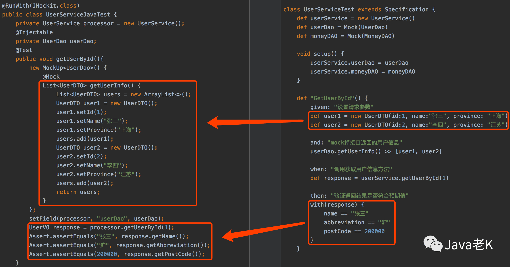

# Spock

+ <https://github.com/spockframework/spock-example>

- 【美团】Spock单元测试框架介绍以及在美团优选的实践: <https://zhuanlan.zhihu.com/p/399510995>
- Spock单元测试系列 （BDD行为驱动测试）: <http://javakk.com/category/spock>
- Spock单元测试框架介绍以及在美团优选的实践: <https://zhuanlan.zhihu.com/p/399510995>

**特别：**  
spock关注的是`单元测试`，而非`集成测试`！

## Spock 结构化单元测试带来的好处

spock 结构化单元测试，带来的好处： 更易阅读、编写。